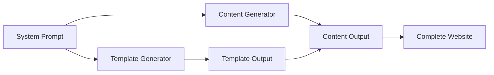

# Notion Website Developer - System Prompts Guide

This guide explains the architecture, design principles, and customization options for the Notion Website Developer prompt system.

## Table of Contents

1. [System Architecture](#system-architecture)
2. [Prompt Components](#prompt-components)
3. [How Prompts Work Together](#how-prompts-work-together)
4. [Customization Guide](#customization-guide)
5. [Best Practices](#best-practices)
6. [Advanced Techniques](#advanced-techniques)

## System Architecture

### Overview

The Notion Website Developer uses a modular prompt architecture designed for:

- **Separation of Concerns**: Each prompt handles specific tasks
- **Reusability**: Shared context prevents duplication
- **Flexibility**: Works standalone or integrated
- **Maintainability**: Easy to update and extend

### Architecture Diagram

```
┌─────────────────────────────────────────┐
│   notion_website_developer.system.prompt │
│          (Shared Foundation)             │
├─────────────────┬───────────────────────┤
│                 │                       │
▼                 ▼                       │
Template          Content                 │
Generator ──────► Generator               │
                  │                       │
                  ▼                       │
              Notion Website              │
└─────────────────────────────────────────┘
```

### Design Principles

1. **Single Source of Truth**: Knowledge base schema defined once
2. **Progressive Enhancement**: Start simple, add complexity
3. **Graceful Degradation**: Works without all features
4. **User-Centric**: Interactive discovery when needed

## Prompt Components

### 1. System Prompt

**File**: `notion_website_developer.system.prompt.md`

**Purpose**: Provides persistent context shared by all components

**Key Sections**:
- System overview and mission
- Knowledge base schema
- Tool requirements and fallbacks
- Design principles
- User interaction framework

**When to Use**: Always loaded as foundation

### 2. Template Generator

**File**: `notion_website_template_generation.user.prompt.md`

**Purpose**: Creates structured website templates

**Key Features**:
- 5-phase workflow (Setup → Analysis → Research → Design → Delivery)
- Research-backed best practices
- Platform-agnostic approach
- Interactive preference gathering

**Outputs**: Notion-compatible markdown template

### 3. Content Generator

**File**: `notion_website_content_generation.user.prompt.md`

**Purpose**: Populates templates with personalized content

**Key Features**:

- Content strategy framework
- SEO optimization
- Conversion focus
- Brand voice consistency

**Outputs**: Complete website content

## How Prompts Work Together

### Workflow Integration



### Data Flow

1. **System Prompt** defines shared schema
2. **Template Generator** creates structure using schema
3. **Content Generator** fills structure with data
4. **Knowledge Base** persists information between steps

### Execution Patterns

#### Pattern 1: Full Workflow
```
1. Load system prompt
2. Run template generator
3. Save template output
4. Run content generator with template
5. Export complete website
```

#### Pattern 2: Template Only
```
1. Load system prompt
2. Run template generator
3. Export template for manual content
```

#### Pattern 3: Content Only
```
1. Load system prompt
2. Provide existing template
3. Run content generator
4. Export populated content
```

## Customization Guide

### Modifying the System Prompt

#### Adding New Data Fields

```yaml
# In knowledge_base section, add:
custom_fields:
  industry_specific:
    healthcare:
      - certifications
      - compliance_training
    finance:
      - licenses
      - regulatory_knowledge
```

#### Changing Operating Modes

```yaml
# Add new mode:
operating_modes:
  expert_mode:
    description: "Advanced features for power users"
    features:
      - custom_css
      - api_integrations
      - analytics_setup
```

### Customizing Template Generation

#### Industry-Specific Templates

```markdown
# Add to template generator:
industry_templates:
  software_engineering:
    sections: ["Technical Skills", "Open Source", "System Design"]
    emphasis: "Code quality and scalability"
  
  marketing:
    sections: ["Campaigns", "Analytics", "Brand Strategy"]
    emphasis: "ROI and growth metrics"
```

#### Custom Section Types

```markdown
# Define new section:
custom_sections:
  testimonials_carousel:
    structure: "Rotating quotes with attribution"
    notion_blocks: ["Quote", "Divider", "Caption"]
    mobile_friendly: true
```

### Enhancing Content Generation

#### Tone Variations

```markdown
# Add tone options:
content_tones:
  executive:
    style: "Strategic and results-focused"
    vocabulary: "Business impact terms"
    
  technical:
    style: "Detailed and precise"
    vocabulary: "Industry-specific jargon"
    
  creative:
    style: "Engaging and narrative"
    vocabulary: "Descriptive and emotive"
```

#### Content Formulas

```markdown
# Achievement formula:
achievement_template: |
  [Action Verb] [Specific Task] resulting in [Quantified Outcome]
  by [Method/Approach], impacting [Business Metric]

# Example:
"Optimized cloud infrastructure resulting in 40% cost reduction
by implementing auto-scaling, impacting quarterly EBITDA"
```

## Best Practices

### 1. Prompt Engineering

**Use Specific Instructions**:
```markdown
# Good
"Create a hero section with name, title, and one-sentence value proposition"

# Better
"Create a hero section containing:
1. Full name (H1, 32px)
2. Professional title (H2, 24px)
3. Value proposition (max 15 words, outcome-focused)"
```

**Provide Examples**:
```markdown
# Include concrete examples
Example value propositions:
- "Scaling startups through data-driven growth strategies"
- "Building secure, compliant healthcare platforms"
```

### 2. Knowledge Base Management

**Structure for Reusability**:
```yaml
# Good structure
skills:
  categories:
    technical:
      frontend: ["React", "TypeScript", "CSS"]
      backend: ["Python", "Node.js", "PostgreSQL"]
    soft:
      leadership: ["Team Management", "Mentoring"]
      communication: ["Public Speaking", "Writing"]
```

**Version Control**:
```yaml
metadata:
  version: "1.2.0"
  last_updated: "2024-01-15"
  update_notes: "Added industry-specific fields"
```

### 3. Error Handling

**Graceful Fallbacks**:
```markdown
# In prompts:
"If web search is unavailable, use these default best practices:
- Mobile-first design
- Clear navigation
- Above-fold CTA
- Social proof section"
```

**Validation Steps**:
```markdown
# Add validation
"Before proceeding, verify:
□ All required fields have values
□ No placeholder text remains
□ Links are properly formatted
□ Email/phone are valid"
```

## Advanced Techniques

### 1. Dynamic Adaptation

**Skill-Based Customization**:
```python
# Pseudo-logic in prompt
if skills include "AI/ML":
    add_sections(["ML Projects", "Research Papers"])
    emphasize("Innovation and technical depth")
elif skills include "Sales":
    add_sections(["Client Wins", "Revenue Impact"])
    emphasize("Relationship building and results")
```

### 2. Multi-Language Support

```markdown
# Template structure
language_variants:
  en:
    hero_cta: "Let's Connect"
    about_header: "About Me"
  es:
    hero_cta: "Conectemos"
    about_header: "Acerca de Mí"
```

### 3. A/B Testing Templates

```markdown
# Define variants
template_variants:
  variant_a:
    section_order: ["Hero", "Skills", "Experience"]
    cta_style: "Button"
    
  variant_b:
    section_order: ["Hero", "Experience", "Skills"]
    cta_style: "Text link"
```

### 4. Integration Hooks

**External Data Sources**:
```markdown
# LinkedIn import
"If LinkedIn data is available:
1. Parse experience section
2. Extract skills endorsements
3. Import recommendations
4. Generate summary from about section"
```

**Analytics Setup**:
```markdown
# Add tracking
"Include analytics placeholders:
- Google Analytics ID field
- Conversion event markers
- Heatmap integration points"
```

### 5. Performance Optimization

**Lazy Loading**:
```markdown
# Structure for performance
"Organize content for lazy loading:
- Above fold: Hero, primary CTA
- First scroll: Key achievements
- Below: Detailed experience
- Footer: Complete contact info"
```

## Troubleshooting Prompts

### Common Issues

**Output Too Generic**:
- Add more specific examples
- Include industry context
- Provide target audience details

**Inconsistent Formatting**:
- Define strict templates
- Include format examples
- Add validation steps

**Missing Personalization**:
- Ensure knowledge base is complete
- Add fallback questions
- Include discovery phase

### Debug Mode

Add to any prompt:
```markdown
# Debug mode
"When debug=true:
1. Show reasoning for each decision
2. List all assumptions made
3. Highlight missing information
4. Provide confidence scores"
```

## Future Enhancements

### Planned Features

1. **Visual Theme Engine**: Color schemes and typography
2. **Component Library**: Reusable Notion blocks
3. **SEO Analyzer**: Built-in optimization scoring
4. **Portfolio Showcase**: Work sample templates
5. **Multi-Platform Export**: Beyond Notion

### Community Contributions

Ways to extend the system:
- Industry-specific templates
- Language translations
- Design variations
- Integration scripts
- Success stories

---

**Ready to customize?** Start with small modifications to test changes, then build your perfect system →

